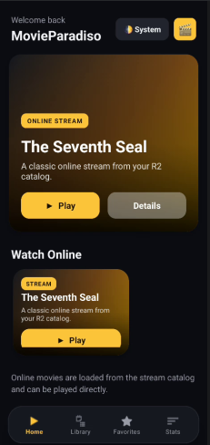
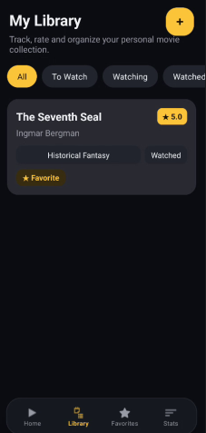
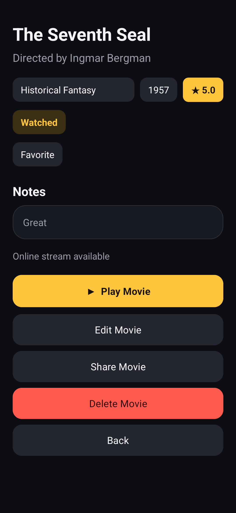
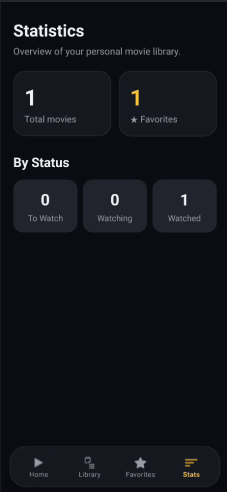
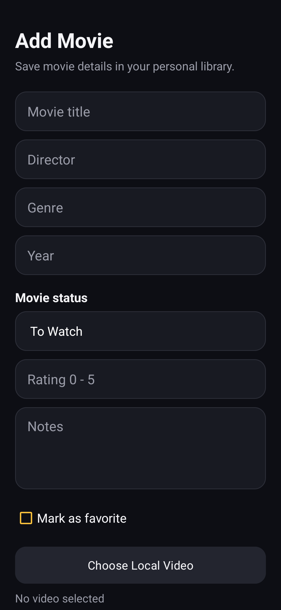
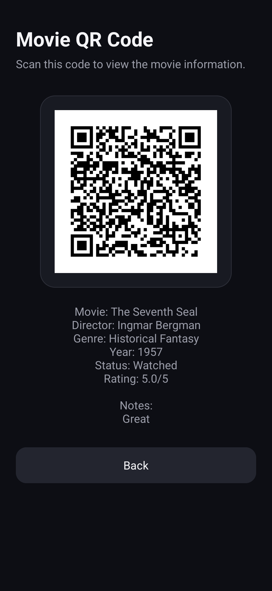

# MovieParadiso

> Лична филмова библиотека с онлайн стрийминг, написана на Kotlin (Android).

**GitHub репо:** `MobileApps2026-2301681057`
**Автор:** Алекс Къцов, ФН: `2301681057`

---

##  Идея

**MovieParadiso** е мобилно приложение за управление на лична колекция от филми.
Потребителят може да добавя филми, да ги оценява, да следи статуса им
(за гледане / гледа се / гледан), да маркира любими и да прикача локално видео
или да гледа онлайн стрийм директно в приложението. Допълнително има екран със
статистика, генериране на QR код и споделяне на филм.

Приложението е насочено към хора, които искат бързо да организират какво са
гледали и какво им предстои, без излишна сложност.

---

##  Как работи

Приложението има **4 основни таба** (долна навигация):

| Таб | Какво прави |
|-----|-------------|
| **Home** | Показва онлайн каталог за стрийминг. Избран филм е изведен в „hero" карта с бутони **Play** (пуска стрийма) и **Details** (отваря детайли). Под него — хоризонтален списък с онлайн филми. Има и превключвател на темата (System → Light → Dark). |
| **Library** | Личната колекция. Филтри по статус (All / To Watch / Watching / Watched). Бутон **+** добавя нов филм. Тап върху филм отваря детайлите му. |
| **Favorites** | Само филмите, маркирани като любими. |
| **Stats** | Статистика: общ брой филми, брой любими и разпределение по статус. |

**Поток на данните:**
1. Потребителят добавя/редактира филм през формата (`AddEditMovieActivity`).
2. Данните се валидират (задължителни полета, валидна година 1888–2100, рейтинг 0–5)
   и се записват в **Room** база.
3. Списъците (`LiveData`) се обновяват автоматично през `ViewModel`.
4. Данните се **запазват след рестарт**, защото са в локалната база.

**Възпроизвеждане на видео:**
- Локално видео → `PlayerActivity` (Media3 / ExoPlayer).
- Онлайн стрийм → `VlcPlayerActivity` (libVLC) с контроли за пауза, превъртане,
  избор на аудио пътека и субтитри.

**Допълнителни функции:**
- **QR код** — от детайлите на филм (Share → *Show QR Code*) се генерира QR код
  с информацията за филма (ZXing).
- **Share Intent** — споделяне на филма като текст към друго приложение.

---

##  Архитектура

Приложението следва **MVVM + Repository** слой:

```
UI (Activities / Fragments)
        │  observe (LiveData)
        ▼
   ViewModel  (MovieViewModel)
        │
        ▼
   Repository (MovieRepository)
        │
        ▼
   Room DAO (MovieDao) ──► MovieDatabase (SQLite)
```

- **View** — `MainActivity`, `HomeFragment`, `LibraryFragment`,
  `FavoritesFragment`, `StatsFragment`, `MovieDetailsActivity`,
  `AddEditMovieActivity`, `QrCodeActivity`, `PlayerActivity`, `VlcPlayerActivity`.
- **ViewModel** — `MovieViewModel` (+ `MovieViewModelFactory`), излага `LiveData`.
- **Repository** — `MovieRepository`, единствена точка за достъп до данните.
- **Data** — `MovieEntity`, `MovieDao`, `MovieDatabase` (Room),
  `OnlineMovie` + `StreamCatalog` (източник за онлайн филмите).

**Технологии:**
- Kotlin, ViewBinding
- Room (persistence) + Coroutines
- Lifecycle / LiveData / ViewModel
- Material Components (light/dark тема)
- Media3 ExoPlayer (локално видео) и libVLC (онлайн стрийм)
- ZXing (QR код)

**Параметри:**
- `minSdk = 24`, `targetSdk = 36`, `compileSdk = 36`, JDK 17

---

##  Потребителски поток

```
MainActivity (Home)
 ├─ Play           → VlcPlayerActivity (онлайн стрийм)
 ├─ Details        → MovieDetailsActivity (онлайн режим)
 ├─ Library        → AddEditMovieActivity (+ нов филм)
 │                 → MovieDetailsActivity (тап върху филм)
 │                      ├─ Play   → PlayerActivity / VlcPlayerActivity
 │                      ├─ Edit   → AddEditMovieActivity
 │                      ├─ Share  → текст / QrCodeActivity
 │                      └─ Delete → потвърждение → изтриване
 ├─ Favorites      → списък с любими → MovieDetailsActivity
 └─ Stats          → статистика
```

---

##  Стъпки за стартиране

1. Клонирай репото:
   ```bash
   git clone https://github.com/<ZeroVik>/MobileApps2026-2301681057.git
   cd MobileApps2026-2301681057
   ```
2. Отвори проекта в **Android Studio** (Hedgehog или по-нов).
3. Изчакай **Gradle Sync** да приключи.
4. Избери емулатор или реално устройство (Android 7.0+ / API 24+).
5. Натисни **Run ▶** (`app` конфигурацията).

Билд от команден ред:
```bash
./gradlew assembleDebug      # debug APK
./gradlew assembleRelease    # release APK
```

Пускане на тестовете:
```bash
./gradlew test                  # Unit тестове (JVM)
./gradlew connectedAndroidTest  # Espresso + Room тестове (нужен е емулатор/телефон)
```

---

##  Тестови акаунти

Приложението **не използва вход/регистрация** — всички данни се пазят локално на
устройството. Не са нужни тестови акаунти.

---

##  Скрийншоти


<p align="center">
  
  &nbsp;&nbsp;
  
  &nbsp;&nbsp;
  
</p>

<p align="center">
  
  &nbsp;&nbsp;
  
  &nbsp;&nbsp;
  
</p>

##  APK

Готовият за инсталиране файл се намира в:

```
/apk/app-release.apk
```

Размер: ≤ 60 MB. Инсталиране на устройство:
```bash
adb install apk/app-release.apk
```

---

##  Покрити изисквания

- [x] Kotlin, minSdk 24, targetSdk 36
- [x] MVVM + Repository слой
- [x] Множество екрани + навигация
- [x] Light / Dark тема
- [x] Room база + пълни CRUD операции през UI
- [x] Запазване на данните след рестарт
- [x] Допълнителни функции: **QR код** + **Share Intent**
- [x] Unit тестове + Espresso UI тест